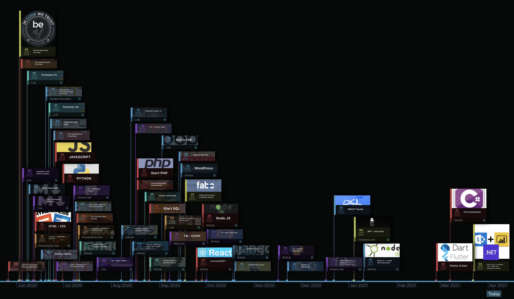

##  Welcome !
> NICODE.IO

####    Hello I'm [Nicolas](https://www.linkedin.com/in/nicolas-denoel/) and welcome to my Github repo. Thank you already for your interest in my profile. You'll find here more information about my work and my motivations, just make yourself at home ;)

---

##  INDEX

- [Skills](#skills)
- [Who am I](#who-am-i)
- [Contacts](#contacts)
- [Timeline](#timeline)

---

##  Skills

 
   

| :iphone::computer: LANGUAGES                            |  :package: FRAMEWORKS              |  :sparkles: SOFT SKILLS                        |  :deciduous_tree: WEEK-END SKILLS |
|---------------------------------------------------------|------------------------------------|------------------------------------------------|-----------------------------------|
| :1st_place_medal:  | :1st_place_medal:  | :white_check_mark: Positive Communication      | :sunrise_over_mountains: Travel   |
| :2nd_place_medal:  :chart_with_upwards_trend | :2nd_place_medal:  :chart_with_upwards_trend:   | :white_check_mark: Team Player & Team Leader   | :camera: Photography              |
| :3rd_place_medal:   :chart_with_upwards_trend: | :3rd_place_medal: | :white_check_mark: Adapting to change          | :helicopter: Drone                |
| :white_check_mark:  | :white_check_mark:   :chart_with_upwards_trend:    | :white_check_mark: Challenge Lover             | :art: Painting                    |
|                                                         | :white_check_mark:  | :white_check_mark: Organized and Structured    | :joystick: Gaming                 |
|                                                         |          | :white_check_mark: Gamification Addict         | :open_hands: Volunteering         |

| :man_technologist: OTHER SKILLS                         |                        
|---------------------------------------------------------|
|       |        

 
                 

---

## Who am I

#### After 15 years in sales and management, I decided to put this career on hold to devote myself fully to development.   
#### Passionate about teamwork, I like to bring motivation to each of my team members in order to work efficiently in a positive environment.   
#### Photography brings me the necessary dose of creativity and discovery, it also contributes to sharpen my sense of detail
#### From June 2020 to Early 2021, I successfully completed the web-developer bootcamp organized by BeCode. This was followed by a first experience in a company. 
#### In March 2021, I will start a new bootcamp dedicated to .NET development with a focus on PowerBI and Sharepoint. This one will end in September 2021.    
#### If you are looking to hire a strong hybrid and atypical profile in your team do not hesitate to contact me to check if we can share a project together !  

---

## Contacts

> :mailbox_with_mail: Get in touch :
- [LinkedIn](linkedin.com/in/nicolas-denoel)
- [Twitter](https://twitter.com/Nicode_IO)
- [Mail](mailto:nicolas@nicode.io) 

---

### Timeline
> Current steps of my reconversion

[:calendar: Discover the timeline of my adventure to become a developer. Want to write your company's name on it ? Let's meet !](https://timelines.gitkraken.com/timeline/2e12cc334eb0406b84bf7a6339e666c4?range=2020-05-26_2021-08-02)

---
