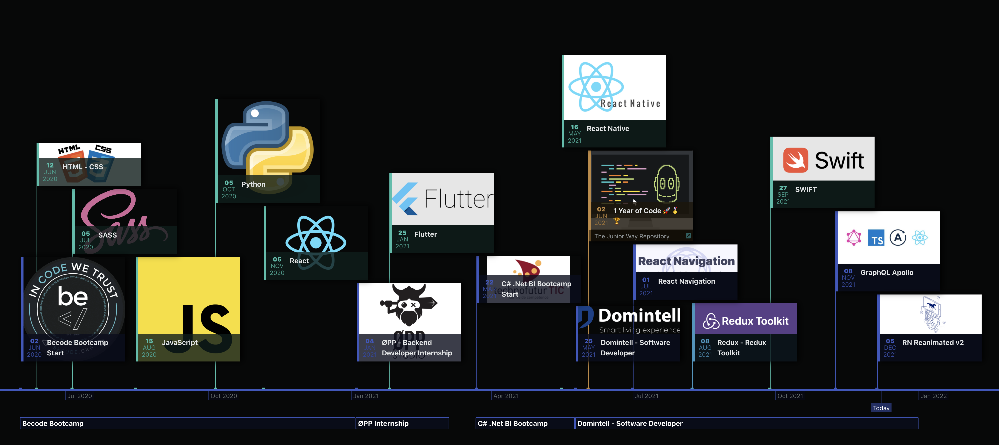

####   
####  Hello follks, 

I'm Nicolas, after a successful career in sales management, I decided in 2020 to devote myself to IT development, more specifically web & mobile application development. Currently I'm working as a React Native developer, creating applications to manage home-automation devices like lights, shutters, cooling/heating system, doors and many more.   

I'm also working on a web-platform to administrate and manage installations, devices and users.     
  
Hard worker, I give myself the means every day to meet the new challenges related to this new career. As I am always looking for a challenge, do not hesitate to share your projects and needs

---

## 🧰 Toolbox

 
 

|  :sparkles: SOFT SKILLS                        |  :deciduous_tree: WEEK-END SKILLS |
|------------------------------------------------|-----------------------------------|
| :white_check_mark: Positive Communication      | :camera: Photography              |
| :white_check_mark: Team Player & Team Leader   | :sunrise_over_mountains: Travel   |
| :white_check_mark: Agile/ SCRUM flow           | :helicopter: Drone                |
| :white_check_mark: Problem-solver              | :art: Painting                    |
| :white_check_mark: Organized and Structured    | :joystick: Gaming                 |
| :white_check_mark: Gamification Addict         | :open_hands: Volunteering         |

| :man_technologist: OTHER SKILLS                         |                        
|---------------------------------------------------------|

---

## &#x1f4c8; Git Stats

---

 

## Timeline

> Current steps and history of my reconversion

